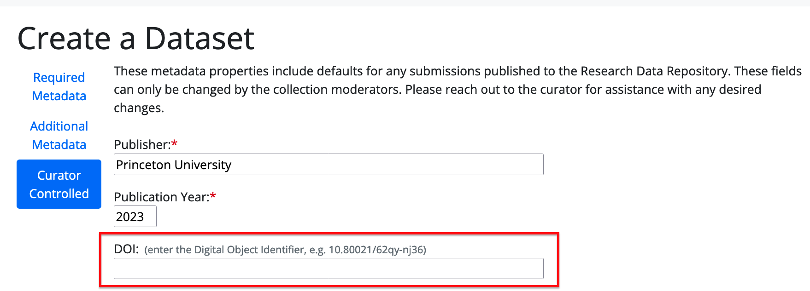

# 8. Migration procedures from DataSpace

Date: 2023-?-?

## Status

Discussion

## Context

We have approximately 370 research data sets in a legacy DSpace application, branded locally as DataSpace. We need to migrate research data objects out of DataSpace and into PDC Describe. There are some challenges inherent in this:

1. Objects in DataSpace are described inconsistently
2. We do not have identifiers for many of the authors and funders
3. We do not have DOIs for many of the objects
4. We do not have README files for many of the objects
5. The objects have not been curated according to our current data curation standards
6. The actual data for the objects can be either in DataSpace or in a Globus instance, or sometimes in both places. 

## Decisions

Our migration process will be as follows:

### Tracking of migration process
1. Tracking will happen in the [DataSpace Collections Migration Tracking Spreadsheet](https://docs.google.com/spreadsheets/d/148EHw1FuYhd4kqov5UA04cpSekMGGlAy3zakBwuowFo/edit#gid=0)
1. Tracking on a per-collection basis will happen in the first tab, labeled "Collections"
   * Note that the spreadsheet indicates an order in which we'd like to migrate collections
2. Tracking on a per-item basis will happen on [the second tab](https://docs.google.com/spreadsheets/d/148EHw1FuYhd4kqov5UA04cpSekMGGlAy3zakBwuowFo/edit#gid=684248489) of the same spreadhsheet
3. When the migration is complete, we will archive any spreadsheets used during the migration in this code repo, in case they are needed for future reference.

### Migration of an individual item

1. Check in with the migration team and agree on which collection is currently being migrated. Ensure the `Migration in progress` column is set to `Yes` for the collection in progress.
1. Indicate on the [individual item tracking sheet](https://docs.google.com/spreadsheets/d/148EHw1FuYhd4kqov5UA04cpSekMGGlAy3zakBwuowFo/edit#gid=684248489) that you are taking a particular item, so we don't get two people trying to migrate the same item. Put your netid in the `curator` column of the spreadsheet. You can also make that row in the spreadsheet a different color. 
1. Authenticate into PDC Describe and click the button with your Name or NetID on it in the top right corner. This will reveal a "Create Dataset" menu item.
     * Migration *must* happen via this menu item instead of via the wizard used for new deposits. Using this menu item is the only way to reach an interface that will let you enter an existing DOI (instead of minting a new one) and is the only way to record that a dataset is the result of a migration.
2.  Re-describe the data set, referring to the metadata in DataSpace (get the url for an item from the spreadsheet). Note that your job is to *re-describe* the item. The metadata in DataSpace is often incomplete and sometimes wrong. Use your best judgement as a data curator. 

### Checklist of migration tasks:

#### DOIs

If a work already has a DOI, it is important that we NOT register a new one. 

1. If there is an existing DOI, enter it on the `Curator Controlled` tab. If this work is from PPPL, it likely has an existing DOI that is not in DataSpace. Go to the [osti website](https://www.osti.gov) to find it. Make sure to record the DOI for the Dataset, *not* the DOI for the publication.
1.  You can also record the associated publication if you want to, as a "Related Object"
2. Not every items in DataSpace will have a DOI. If you do not enter an existing DOI, the system will record a new one.  

#### Creators
1. Enter the creators of the work in publication order. Author order matters. 
2. Enter an ORCID identifier for every creator you can find. There is [a spreadsheet of ORCIDs for PPPL](https://docs.google.com/spreadsheets/d/1U6AuWCLogVGBcNXmH4p6o8ZQc2nleyt0s0TedOpNkC0/edit#gid=0) researchers. If you cannot find an ORCID for a creator on a PPPL dataset, enter their name on [the second tab of the spreadsheet](https://docs.google.com/spreadsheets/d/1U6AuWCLogVGBcNXmH4p6o8ZQc2nleyt0s0TedOpNkC0/edit#gid=1142499854) and someome from PPPL will help you track it down.

#### Description
1. All variations on description are going into the same field. We are not going to distinguish between `abstract` and `description`, or other kinds of descriptive text.
2. Remove all references to `Globus` from the description field. These will not be necessary in the new system, and they are not actually a description of this dataset. 

#### Funders
1. Where possible, identify the funders of the work that created this dataset, along with the Award Number and Award URI if known.
2. In DataSpace, funders are often found listed as a `Contributor`. Sometimes they can also be found in the README file if that exists. 
3. Where possible, record the Research Organization Registry (ROR) identifier for an organization. Consult [https://ror.org/](https://ror.org/).

#### Other contributors
1. Where possible, enter other contributors with their ORCIDs and RORs, if you can find them.

#### Collection
1. Works from PPPL should go into the `Princeton Plasma Physics` group. For PPPL items, also record the subcollection.
2. Everything else goes into the PRDS group.

#### ARK
1. The ARK is the unique identifier from DataSpace that will allow us to migrate the data payload. Make sure to enter the ARK exactly how it appears in DataSpace. 

#### Migrate the data
1. Once your metadata is complete, you can click the "Migrate Data" button and the data from this work will be automatically moved from DataSpace to PDC Describe pre-curation. In some cases this might take a long time. You may need to put the work down for a day and come back to it after the migration process is complete. 

#### Ask someone to check your work
1. We want at least two people from the migration team to check every item. One person should re-describe the item, and another person should check it in PDC Describe, and approve it once it is ready. If there needs to be discussion about the correct description, use the PDC Describe interface so we can exercise that interface functionality, and also so we will have a record of the discussion and the decision that was reached. 
2. When the item has been checked and approved, the data will be automatically moved to PDC's post-curation data store, and the metadata will be indexed in PDC Discovery. Check that it is appearing as expected, and that the data can be downloaded as expected.

#### Mark the item complete on the migration spreadsheet
1. When the migration of a work is finished, put its PDC Describe id into the tracking spreadsheet, and turn that row in the spreadsheet green.
2. When all of the works for a particular collection are finished, indicate this in the collection tracking spreadsheet. 

## After the migration
1. We will take a second pass to ensure that there were no new works added to DataSpace after we started the migration
2. We will archive the spreadsheets used in the migration process
3. We will backup and then disable the collections that have been migrated, and direct all new deposits for a migrated collection to use PDC Describe

## Consequences

1. We are making every effort to comply with Core Trust Seal best practices during this data migration. We are recording the identity of the person who is redescribing the work, and the identity, timestamp, and checksum values for the data that is migrated. 