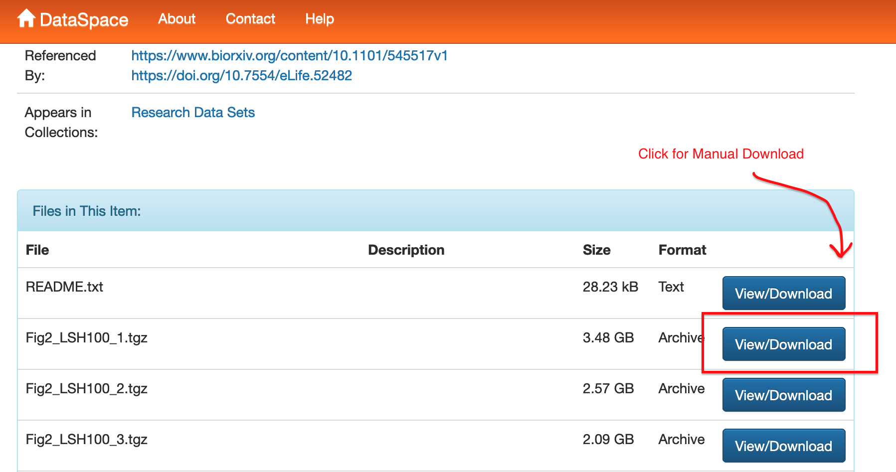

# Manual Data Migration

## Status

Discussion

## Context

Some DataSpace objects cannot be automatically migrated. As of June 2023 this includes works whose attachments in DataSpace are so substantial that the network connection used by the automated migration process times out. Because we believe the number of these items will be small, the team decided not to optimize the code to handle this rarely encountered use case. Instead, we will migrate the object by hand. This mimics the practices in place at PUL for several years before the DataSpace --> PDC Describe migration started, where very large data deposits in DataSpace were transferred to Globus manually. This will also be the process to follow for any items that give a "Checksums do not match" error during migration. Thus far in our testing, checksums fail to match when the network connection times out and the download doesn't complete correctly via the automated migration process. 


## Decisions

### Manual Migration Process

1. Ensure it's clear in the migration workflow who is working on the migration for this particular item. This process can take awhile, and we do not want two people attempting it at the same time.
2. Create a local directory named for the DOI of the work under migration. In this example, a DOI `https://doi.org/10.34770/r2dz-ys12` should have its data downloaded into a directory called `r2dz-ys12`
3. Go to DataSpace and download the data payloads to your local computer manually, saving them to the directory you just created. This process can be lengthy. Pay close attention to ensure you download all files and all downloads are complete. Downloading one file at a time is recommended. 
  
  

4. Once all files are downloaded, upload them to the `prds-dataspace` S3 bucket using the [aws cli](https://docs.aws.amazon.com/cli/latest/userguide/getting-started-quickstart.html) or a GUI client with S3 access. Ensure all the files are in a directory named for the DOI:
  ```
  aws s3 sync r2dz-ys12 s3://prds-dataspace/10-34770/r2dz-ys12/
  ```
5. Add the work's ark to the list in `config/manual_dataspace_migration.yml` and commit the changes. Once that change is deployed, the software will no longer attempt to auto-migrate DataSpace files for this object, but will still auto-migrate the files from Globus.