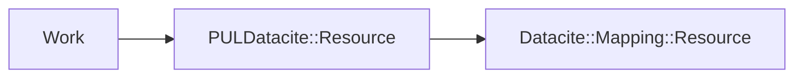

# Datacite Records

Each `Work` object has a `PULDatacite::Resource` object associated with it. 
`PULDatacite::Resource` is a class encapsulating any local PUL decisions we make about building our Datacite records. 

To map and serialize to Datacite XML, we use the [datacite-mapping](https://github.com/CDLUC3/datacite-mapping) gem published by the California Digital Library. 



## Getting the DataCite record for a work via the application

For any work you can append `/datacite` to the url to get the DataCite XML serialization for that work:

```example
https://pdc-describe-prod.princeton.edu/describe/works/3/datacite
```

## Getting the DataCite record in the code

Note that we have FactoryBot definitions of some legacy datasets in `spec/factories/work.rb`

```ruby
work = FactoryBot.create(:shakespeare_and_company_work)
work.datacite_resource # => PULDatacite::Resource
work.datacite_resource.datacite_mapping # => Datacite::Mapping::Resource
work.datacite_resource.to_xml # => Returns a DataCite 4.4 record as XML
```

## Reference Material

1. [DataCite XML Reference](https://schema.datacite.org/meta/kernel-4/)
1. [datacite-mapping rubydocs](https://www.rubydoc.info/gems/datacite-mapping/0.4.1)
