## Emails vs Notifications

Notifications are stored in the database and are shown to the user on each work.  They can be viewed in the system on the Notification page for each user.

Emails are sent by notifications only if the user has not turned off emails entirely or for the group or subgroup.  Emails can be configured by the user in their profile.  There is no record kept in the system if an email is sent.

## Message Notifications

### Curator comments on work with no @

```mermaid
sequenceDiagram
    actor researcher as Depositor
    actor curator as Curator
    participant work as Work
    participant basic as Basic Message
    curator-->>work: comments
    work-->>basic: COMMENT
    basic->>researcher: message sent 📫
```

### Researcher comments on work with no @

```mermaid
sequenceDiagram
    actor researcher as Depositor
    participant work as Work
    participant basic as Basic Message
    researcher-->>work: comments
    work-->>basic: COMMENT
    basic->>researcher: message sent 📫
```

### Curator comments on work @ user

```mermaid
sequenceDiagram
    actor researcher as Any User
    actor curator as Curator
    participant work as Work
    participant basic as Basic Message
    curator-->>work: comments with @
    work-->>basic: COMMENT
    basic->>researcher: message sent 📫
```

### Researcher comments on work @ user

```mermaid
sequenceDiagram
    actor user as Any User
    actor researcher as Depositor
    participant work as Work
    participant basic as Basic Message
    researcher-->>work: comments with @
    work-->>basic: COMMENT
    basic->>user: message sent 📫
```

### Curator comments on work @ group

```mermaid
sequenceDiagram
    participant user as Curator group 👥
    actor curator as Curator
    participant work as Work
    participant basic as Basic Message
    curator-->>work: comments with @ group
    work-->>basic: COMMENT
    basic->>user: message sent 📫
```

### Researcher comments on work @ group

```mermaid
sequenceDiagram
    participant user as Curator group 👥
    actor researcher as Depositor
    participant work as Work
    participant basic as Basic Message
    researcher-->>work: comments with @ group
    work-->>basic: COMMENT
    basic->>user: message sent 📫
```

## State Transition Notifications

### New work Drafted

### Work submitted awaiting approval

```mermaid
sequenceDiagram
    participant curator as Curator group 👥
    actor researcher as Researcher
    participant work as Work
    participant activity as Work Activity
    participant transition as Work Transition Activity
    participant review as Ready for Review
    researcher-->>work: Submitted
    work-->>activity: SYSTEM (no Email sent)
    work-->>activity: NOTIFICATION (via WorkTransitionActivity)
    activity-->>review: Notify group and researcher
    review->>curator: ready for review 📫
    review->>researcher: ready for review 📫
```

### Work approved by a curator

```mermaid
sequenceDiagram
    actor researcher as Researcher
    participant curators as Curator group 👥
    actor curator as Curator
    participant work as Work
    participant activity as Work Activity
    participant transition as Work Transition Activity
    participant basic as Basic Message
    curator-->>work: Approved
    work-->>activity: System (triggers no email)
    work-->>activity: Notification (via WorkTransitionActivity)
    activity-->>basic: Notify group and researcher
    basic->>curators: approved 📫
    basic->>researcher: approved 📫
```

### Work rejected by a curator

```mermaid
sequenceDiagram
    actor researcher as Researcher
    participant curators as Curator group 👥
    actor curator as Curator
    participant work as Work
    participant activity as Work Activity
    participant reject as Submission Rejected
    curator-->>work: Rejected
    work-->>activity: System (triggers no email)
    work-->>activity: Notification (via WorkTransitionActivity)
    activity-->>reject: Notify group and researcher
    reject->>curators: rejected 📫
    reject->>researcher: rejected 📫
```

