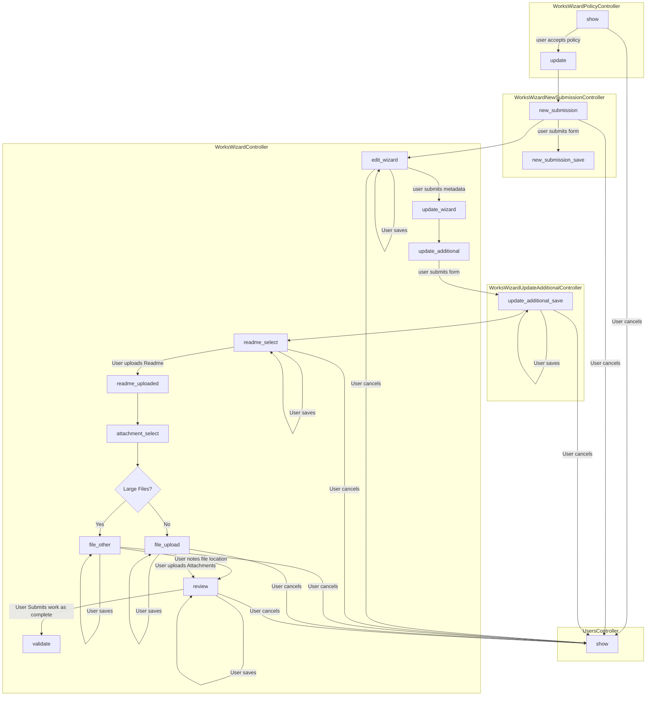

```mermaid
 flowchart TD
    subgraph UsersController
      user_show[show]
    end
    subgraph WorksWizardPolicyController
      show -- user accepts policy --> update
      show -- User cancels --> user_show
    end
    update --> new_submission
    subgraph WorksWizardNewSubmissionController
        new_submission -- user submits form --> new_submission_save
        new_submission -- User cancels --> user_show
    end
    new_submission --> edit_wizard
    subgraph WorksWizardController
        edit_wizard -- user submits metadata --> update_wizard
        edit_wizard -- User cancels --> user_show
        edit_wizard -- User saves --> edit_wizard
        update_wizard --> update_additional
        readme_select -- User uploads Readme --> readme_uploaded
        readme_select -- User cancels --> user_show
        readme_select -- User saves --> readme_select
        readme_uploaded --> attachment_select
        attachment_select --> attachment_selected{Large Files?}
        attachment_selected -->|Yes| file_other
        attachment_selected -->|No| file_upload
        file_other -- User notes file location --> review
        file_other -- User cancels --> user_show
        file_other -- User saves --> file_other
        file_upload -- User uploads Attachments --> review
        file_upload -- User cancels --> user_show
        file_upload -- User saves --> file_upload
        review -- User Submits work as complete --> validate
        review -- User cancels --> user_show
        review -- User saves --> review
    end

    subgraph WorksWizardUpdateAdditionalController
      update_additional-- user submits form --> update_additional_save
      update_additional_save -- User cancels --> user_show
      update_additional_save -- User saves --> update_additional_save
      update_additional_save --> readme_select
    end
```