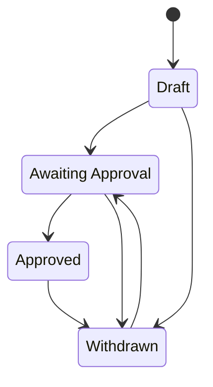

# Work States
This document describes the different states works go through as part of the systen

## State Definitions

* Draft - The creator is in the process of depositing their dataset into PDC Describe
   * It must have a draft DOI
   * It must have a title
   * It must have a collection
* Awaiting Approval - The creator is ready for a curator to review their dataset and metadata
   * It must have all required metadata (**TODO:** what is this)
   * Do we send notifications?
* Approved - The curators are ready for this dataset to be published for the public to find
   * Added to PDC describe
   * published in DataCite
   * Move to the Princeton Data Commons Globus collection
   * Do something with the ARK??
* Withdrawn - The user no longer want to publish this dataset.  
    * removed from PDC Describe
    * It should be pulled down from Globus public view
    * Marked as Registered DataCite
    * do we need to do anything with the ARK ??

