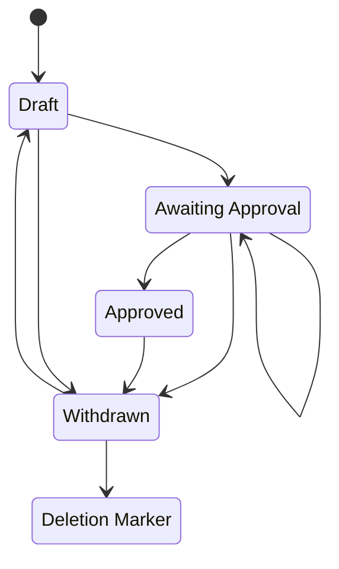

# Work States
This document describes the different states works go through as part of the systen

## State Definitions

* Before it is saved its state is empty
* Draft - The creator is in the process of depositing their dataset into PDC Describe
   * It must have a draft DOI
   * It must have a title(s)
   * It must have a creator(s)
   * It must have a group (it may be a default)
   * We send notification to moderator(s) of the group and the depositor
      * in app notification
      * email
* Awaiting Approval - The creator is ready for a moderator to review their dataset and metadata
   * Complete the wizard
      * description
      * publication year (default to current year)
      * publisher (default Princeton)
      * one or more files
   * We send notification to moderator(s) of the group and the depositor
      * in app notification
      * email
* Approved - The moderators are ready for this dataset to be published for the public to find
   * Indexed to PDC Discovery
   * published in DataCite with the PDC Discovery URL
   * Move to the Princeton Data Commons Globus Collection
   * No ARK will be minted for newly deposited items
   * An item with an existing ARK should be updated to have the new PDC Discovery URL
   * We send notification to moderator(s) of the group and the depositor
      * in app notification
      * email
* Withdrawn - The user no longer wants to publish this dataset.  
    * removed from PDC Discovery Index
    * Marked as Registered DataCite
    * Notify the Moderators
      * Removed the Data & delete the object
    * If an ARK exists we should withdraw it
   * We send notification to moderator who approved the work and the depositor
      * Draft to withdrawn will not notify
      * in app notification - awaiting approval & approved
      * email - awaiting approval & approved
* Deletion Marker - The Moderator has deleted the data and specified that this will not be recovered
   * The moderator would delete files **(not automated)**
   * The moderator may have the ability to delete the DOI **(not automated)** 

